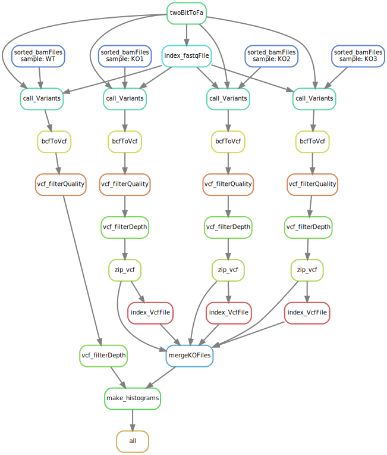

# Skeleton for the Snakemake workflow



This pipeline starts with BAM files and a fastq reference. BAM files are sorted on postion and an index is created for each BAM. 
mm10.fa are called on the sorted BAM this result in a VCF(Variant Calling Format) file for each BAM.
Once all sample have been filtered all the VCF files that contain KO will be merged into 1 VCF. Next step is to create a histogram where the variants
for each chromosome are displayed.

To use this pipeline you need Bam files they can be downloaded form: 
https://usegalaxy.org/u/carlosfarkas/h/test-sall2-ko-rna-seq-gse123168-1

And the 2bit file from:
http://hgdownload.cse.ucsc.edu/goldenpath/mm10/bigZips/mm10.2bit

```diff
Required software:
* snakemake
* twoBitToFa 
```

twoBitToFa can be downloaded from http://hgdownload.cse.ucsc.edu/admin/exe/ (linux and MacOS)

Create the environment and install all necessary tools to run the pipeline.

**Create the environment and install snakemake.**
```
virtualenv -p /usr/bin/python3 venv
source venv/bin/activate

#install snakemake
pip3 install snakemake
```

In the config.yaml you can set the name and directory to the samples and the
reference fasta need for the pipeline. 


**2bitfile**: Name and path to reference without extension.

**samples**: Samples used in the pipeline.

```
2bitfile: bit_files/mm10.2bit
samples:
    A : KO1
    B : KO2
    C : KO3
```

Once the environment has been activated and the config has the required input.
You can start the workflow by simply typing:  
Add for cores the number of cores you want to use.
```
snakemake -c [cores]
```

Following short description of all the rules used in this pipeline.
Although most of the time the name is already self explanatory.

```
rule twoBitToFa
```
Makes form a 2bit file a fa file. 
Change twoBitToFa-linux to twoBitToFa for macOS.

```
rule index_fastqFile
```
This rule index the fa so it becomes a fa.fai. This makes it 
possible to call te variants.

```
rule sorted_bamFiles
```
This rule uses samtools sort for sorting the bam files.

```
rule call_Variants
```
This rule calls the variants and write it to a raw.bcf file. 

```
rule bcfToVcf:
```
translate a bcf to vcf so it is readable.

```
rule vcf_filterQuality:
```

This rule uses the python script that is included in script/ and filters out the 
quality that are lower than 30. 

```
rule vcf_filterDepth:
```
This rule uses the python script that is included in script/ and filters out the 
dp under info that are lower than 10. 
```
rule zip_vcf:
```
Zips the file and makes it ready for merge

```
rule index_VcfFile:
```
Index the file so it is ready for merge
```
rule mergeKOFiles:
```
Merged all the files that contain *KO*

```
rule make_histograms:
```
Creat a raster with histograms for the variation in each chromosome. 


